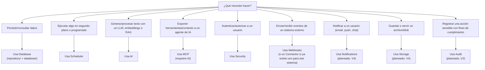
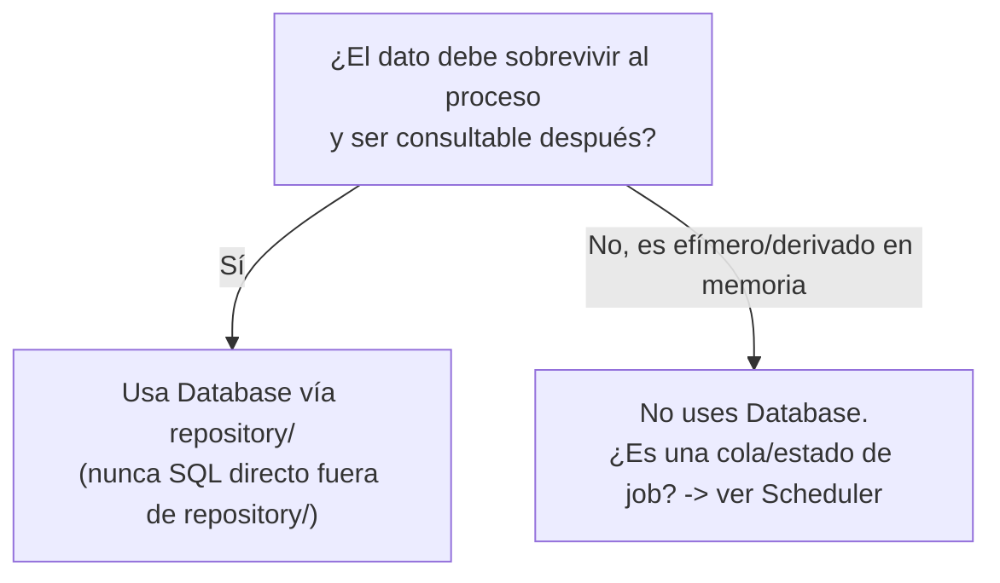
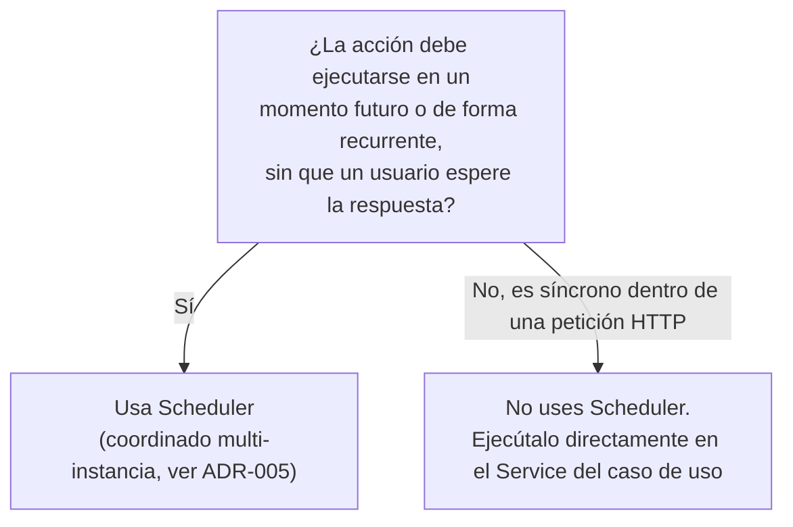
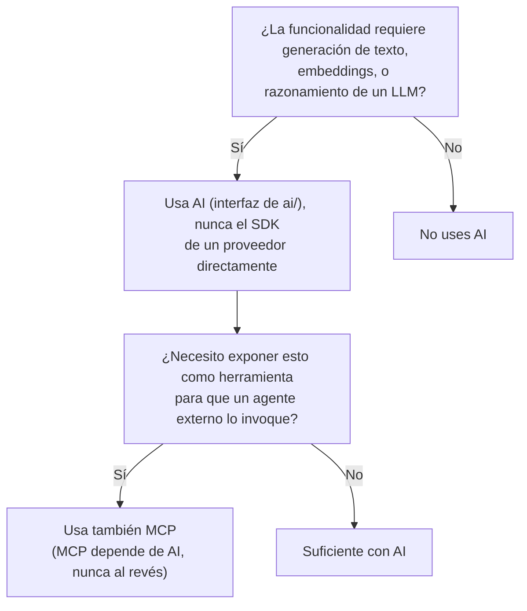
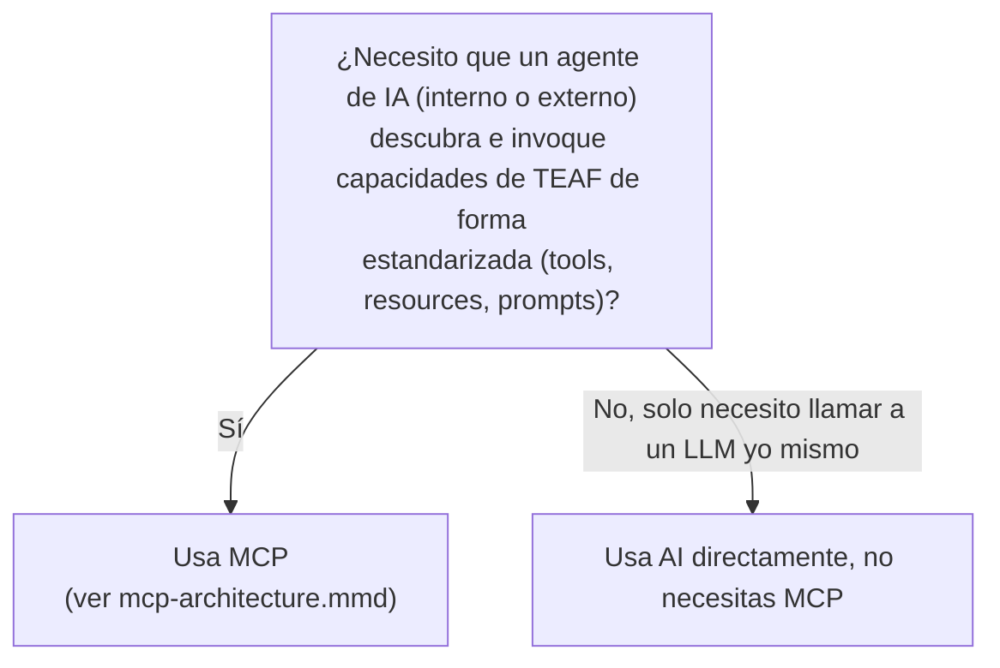
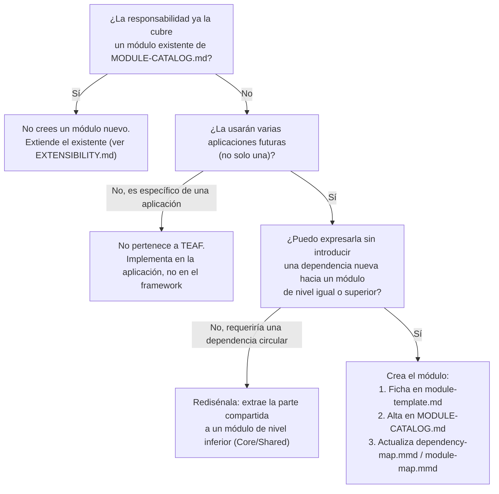
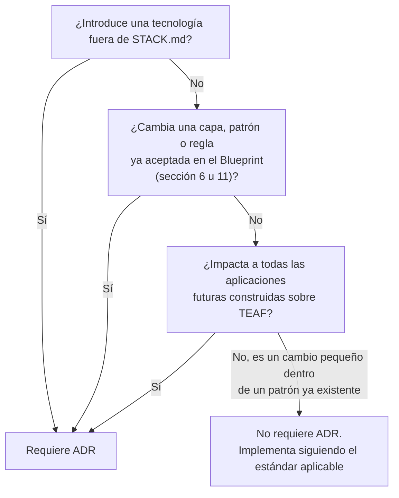

# Árbol de decisiones — TEAF

Ayuda a cualquier desarrollador (humano o agente de IA) a decidir rápidamente qué módulo usar, cuándo crear uno nuevo y cuándo se necesita un ADR, sin tener que releer toda la documentación cada vez. Complementa [FRAMEWORK-BLUEPRINT.md](FRAMEWORK-BLUEPRINT.md) y [MODULE-CATALOG.md](MODULE-CATALOG.md) — este documento no redefine ninguna regla, solo las convierte en un flujo de decisión navegable.

## 1. ¿Qué módulo utilizar?

Ver la ficha completa de cada módulo (objetivo, estado, dependencias) en [MODULE-CATALOG.md](MODULE-CATALOG.md).

## 2. ¿Cuándo usar Database?

Regla asociada: `repository/` nunca contiene lógica de negocio (ver [DATABASE-STANDARD.md](../standards/DATABASE-STANDARD.md)).

## 3. ¿Cuándo usar Scheduler?

## 4. ¿Cuándo usar AI?

Regla asociada: `AI` nunca accede a `Database` directamente — la persistencia de embeddings pasa por `repository/` (ver [FRAMEWORK-BLUEPRINT.md, sección 6](FRAMEWORK-BLUEPRINT.md#6-reglas-de-dependencias) y [`ai-provider-architecture.mmd`](../diagrams/ai-provider-architecture.mmd)).

## 5. ¿Cuándo usar MCP?

## 6. ¿Cuándo crear un nuevo módulo?

## 7. ¿Cuándo crear un nuevo ADR?

Ver el flujo completo de propuesta y aceptación en [CLAUDE.md, sección 12](../../CLAUDE.md) y la plantilla en [`/templates/adr-template.md`](../../templates/adr-template.md).
