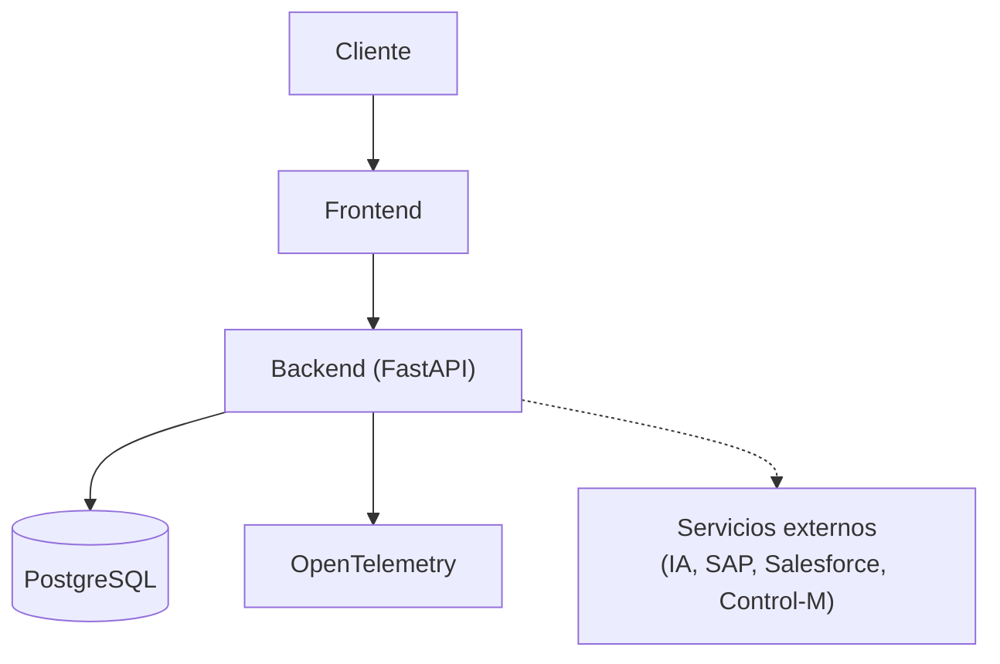
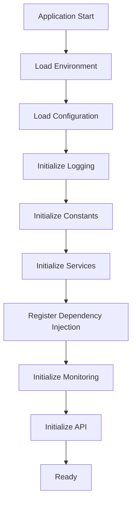
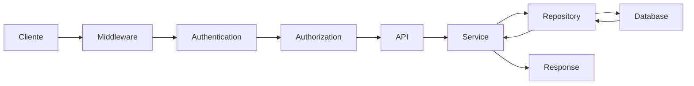
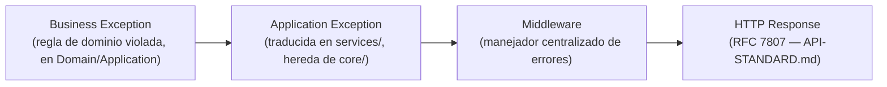

# Framework Blueprint — TEAF

Documento maestro de la arquitectura técnica oficial de TEAF. Es el nivel de detalle que se usará durante todo el desarrollo del framework a partir de la Versión 1 del [roadmap](../roadmap/ROADMAP.md).

Este blueprint **complementa** — no reemplaza — [ARCHITECTURE.md](ARCHITECTURE.md), que sigue siendo la referencia de la arquitectura física por carpetas ya aceptada. El blueprint añade una vista lógica de capas al estilo Clean Architecture/DDD, el mapa formal de dependencias entre módulos, los flujos de inicialización/petición/excepción, y el checklist de revisión arquitectónica para Pull Requests. Ningún contenido se duplica: cuando algo ya está documentado en otro archivo, este documento enlaza en vez de repetirlo.

Los diagramas Mermaid que acompañan este documento viven en [`docs/diagrams/`](../diagrams/) como archivos `.mmd` independientes, editables y renderizables nativamente por GitHub.

> **Sprint 2.0.1 — revisión de enriquecimiento**: esta revisión no modifica ninguna decisión ya aceptada en Sprint 2.0 (capas, módulos, dependencias, reglas). Añade documentos y diagramas complementarios de forma incremental. Ver el detalle de qué se añadió y por qué en el resumen ejecutivo de cierre de esta iteración.

## Documentos y diagramas complementarios

| Documento | Contenido |
|---|---|
| [`NFR.md`](NFR.md) | Requisitos no funcionales: disponibilidad, latencia, cobertura, escalabilidad, seguridad, observabilidad, compatibilidad Azure/Docker/IA. |
| [`DECISION-TREE.md`](DECISION-TREE.md) | Árboles de decisión (qué módulo usar, cuándo crear uno nuevo, cuándo crear un ADR). |
| [`EXTENSIBILITY.md`](EXTENSIBILITY.md) | Cómo crear, extender, registrar, versionar y reemplazar implementaciones de módulos, proveedores y conectores. |

| Diagrama | Contenido |
|---|---|
| [`deployment-physical.mmd`](../diagrams/deployment-physical.mmd) | Arquitectura física de despliegue en Azure, con equivalencia directa a Render para desarrollo/POC. |
| [`security-architecture.mmd`](../diagrams/security-architecture.mmd) | Recorrido de seguridad completo: HTTPS, CORS, rate limiting, correlation ID, JWT, RBAC, Key Vault, auditoría. |
| [`ai-provider-architecture.mmd`](../diagrams/ai-provider-architecture.mmd) | Detalle interno del módulo `AI`: interfaz de cliente LLM y proveedores intercambiables (OpenAI, Azure OpenAI, Anthropic, Gemini, Ollama). |
| [`mcp-architecture.mmd`](../diagrams/mcp-architecture.mmd) | Detalle interno del módulo `MCP`: Servers, Clients, Tools, Resources, Prompts y Agent Runtime. |

---

## 1. Visión General

**Objetivo**: TEAF es el framework empresarial base de TORUS — el equivalente interno a Spring Boot o .NET Boilerplate — sobre el que se construyen todas las aplicaciones futuras (TicketGateway, Portal TORUS, Portal NOC, Portal SRE, Inventario TI, Gestor de Incidentes, integraciones SAP/Salesforce/Control-M, IA Empresarial). No contiene lógica de negocio de ninguna aplicación concreta.

**Filosofía**: Clean Architecture con dependencias que siempre apuntan hacia adentro, SOLID/DRY/KISS aplicados sin sobre-ingeniería, y una regla rectora — no se construye para requisitos hipotéticos, se construye para que lo que existe hoy pueda sostenerse y explicarse dentro de 3-5 años. Ver [CLAUDE.md](../../CLAUDE.md), sección 3.

**Principios**: los 14 principios arquitectónicos (API First, Cloud Ready, Docker First, AI Ready, Security by Design, Observability First, Database Agnostic, Configuration by Environment, Modular Architecture, Clean Architecture, Dependency Injection, Repository Pattern, Service Layer, SOLID/DRY/KISS) ya están desarrollados en [ARCHITECTURE.md](ARCHITECTURE.md#2-principios-arquitectónicos); este blueprint los aplica de forma operativa en las secciones siguientes, no los redefine.

**Alcance**: este documento cubre exclusivamente la arquitectura del framework — módulos, capas, dependencias, flujos. No cubre requisitos funcionales de ninguna aplicación construida sobre TEAF.

**Modularidad**: cada capacidad del framework es un módulo con una única responsabilidad, catalogado en [MODULE-CATALOG.md](MODULE-CATALOG.md), con dependencias explícitas y direccionadas (sección 5).

**Escalabilidad y Cloud Ready**: ningún módulo asume estado local ni instancia única (ver [ADR-005](adr/ADR-005-cloud-ready.md)); `Scheduler` y `Webhooks` en particular se diseñan para coordinación segura multi-instancia.

**AI Ready**: la IA es un módulo (`AI`) con dependencias mínimas y controladas (`Core`, `Security`) que **nunca** accede a `Database` directamente — ver la regla explícita en la sección 6 y 11. El módulo desacopla completamente al framework de cualquier proveedor concreto (OpenAI, Azure OpenAI, Anthropic, Gemini, Ollama), y deja preparado el camino hacia capacidades agénticas (`MCP`) sin romper esa interfaz — ver [`ai-provider-architecture.mmd`](../diagrams/ai-provider-architecture.mmd) y [`mcp-architecture.mmd`](../diagrams/mcp-architecture.mmd).

**Security by Design**: autenticación, autorización, gestión de secretos (Azure Key Vault), CORS, rate limiting y auditoría son transversales desde el diseño, no opcionales por endpoint — ver [`security-architecture.mmd`](../diagrams/security-architecture.mmd) y [SECURITY-STANDARD.md](../standards/SECURITY-STANDARD.md).

**Requisitos no funcionales**: las métricas mínimas de disponibilidad, latencia, cobertura, escalabilidad y observabilidad que todo componente debe cumplir están formalizadas en [NFR.md](NFR.md).

## 2. Arquitectura General

TEAF se divide en tres bloques: **Frontend** (React + TypeScript + MUI, capa de Presentación), **Backend** (FastAPI, con sus capas API/Application/Domain/Infrastructure/Persistence) y **Servicios externos** (PostgreSQL, OpenTelemetry, Azure, conectores de integración, proveedores de IA). El bloque transversal (`core/ config/ security/ monitoring/ shared/ scheduler/`) es consumido por todas las capas del backend sin ser consumido por ninguna capa de negocio.



Diagrama completo y editable: [`docs/diagrams/framework-overview.mmd`](../diagrams/framework-overview.mmd). La vista física de despliegue en Azure (y su equivalencia en Render para desarrollo/POC) está en [`docs/diagrams/deployment-physical.mmd`](../diagrams/deployment-physical.mmd), que detalla a nivel de infraestructura lo que [`deployment-view.mmd`](../diagrams/deployment-view.mmd) ya mostraba a nivel lógico.

## 3. Arquitectura por Capas

TEAF adopta, como vista lógica complementaria a la física de [ARCHITECTURE.md](ARCHITECTURE.md#3-arquitectura-en-capas), el modelo de 7 capas habitual en Clean Architecture/DDD empresarial:

```
Presentation → API → Application → Domain → Infrastructure → Persistence → External Services
```

| # | Capa lógica | Carpeta física en TEAF | Puede hacer | NO puede hacer |
|---|---|---|---|---|
| 1 | **Presentation** | `frontend/` | Renderizar UI, consumir la API vía `frontend/src/services/`, gestionar estado de UI. | Acceder a la base de datos, contener reglas de negocio del dominio. |
| 2 | **API** | `backend/api/` + `backend/middleware/` | Enrutar, validar payload con `schemas/`, invocar `Application`. | Contener lógica de negocio, acceder a `models/`/`database/` directamente. |
| 3 | **Application** | `backend/services/` | Orquestar casos de uso, coordinar transacciones, invocar `Domain` y `Persistence` (vía interfaz). | Conocer detalles HTTP, ejecutar SQL. |
| 4 | **Domain** | `backend/models/` + reglas de negocio embebidas en `services/` | Definir entidades, invariantes y reglas de negocio puras. | Depender de frameworks web, ORM concreto o infraestructura. |
| 5 | **Infrastructure** | `core/ · config/ · security/ · monitoring/ · shared/ · scheduler/` | Proveer capacidades transversales (DI, config, auth, observabilidad) a cualquier capa. | Contener lógica de negocio de una aplicación. |
| 6 | **Persistence** | `backend/database/` + `backend/repository/` + `database/migrations/` | Traducir operaciones de dominio a PostgreSQL vía SQLAlchemy. | Contener reglas de negocio. |
| 7 | **External Services** | `backend/webhooks/` + conectores (SAP/Salesforce/Control-M) + proveedores de `backend/ai/` | Integrar sistemas externos detrás de una interfaz estable. | Ser invocada directamente desde `Domain` o `Persistence`. |

> **Nota sobre `Domain`**: TEAF no tiene hoy una carpeta `backend/domain/` dedicada — las reglas de negocio puras conviven en `services/` junto a la orquestación, y las entidades en `models/` junto a la persistencia. Es una simplificación deliberada del Sprint 1, válida mientras el framework no tenga modelos de dominio ricos. Si en el futuro se requieren invariantes de dominio complejas o Value Objects independientes del ORM, se propone **ADR-006: Separar `Domain` de `Persistence`** (ver sección 13 y el reporte final) — no se implementa sin ese ADR aceptado.

Diagrama completo: [`docs/diagrams/layer-architecture.mmd`](../diagrams/layer-architecture.mmd).

## 4. Mapa General del Framework

El inventario completo y versionado de módulos —con objetivo, estado, dependencias, versión objetivo, nivel de reutilización y prioridad— vive en [MODULE-CATALOG.md](MODULE-CATALOG.md). El mapa visual, agrupado por la versión del roadmap en que se incorpora cada módulo (Fundación V1, Plataforma V2, Experiencia V3, Extensión e IA V4, Hardening y DX V5):

Diagrama completo: [`docs/diagrams/module-map.mmd`](../diagrams/module-map.mmd). El detalle interno de `AI` y `MCP` —sin alterar sus dependencias de módulo— vive en [`ai-provider-architecture.mmd`](../diagrams/ai-provider-architecture.mmd) y [`mcp-architecture.mmd`](../diagrams/mcp-architecture.mmd) respectivamente.

## 5. Mapa de Dependencias

Grafo oficial de dependencias estáticas entre módulos — ningún módulo importa algo que no aparezca aquí como su dependencia declarada:

| Módulo | Depende de |
|---|---|
| **Core** | — (capa fundacional; internamente organiza Configuration, Logging, Environment, Utilities, Constants, Exceptions, Health, Version, Dependency Injection) |
| **Security** | Core |
| **Database** | Core |
| **Monitoring** | Core |
| **Scheduler** | Core |
| **AI** | Core, Security |
| **MCP** | AI, Core |
| **Webhooks** | Security |
| **Notifications** | Core |
| **Storage** | Core |
| **Audit** | Security, Monitoring |
| **SAP / Salesforce Connector** | Webhooks |
| **Control-M Connector** | Webhooks, Scheduler |
| **Starter Applications** | Todos los anteriores |

Esta tabla es la misma que corrige [MODULE-CATALOG.md](MODULE-CATALOG.md) en esta iteración (ver la sección "Nota sobre las dependencias declaradas" de ese documento) — se corrigieron `AI` (antes declaraba `Database` como dependencia, violando la regla de la sección 6), `Database` y `Scheduler` (antes declaraban `Configuration`/`Monitoring`, ahora `Core` como regla base) y `MCP` (se añadió `Core`), y se agregó `Starter Applications` como módulo nuevo.

Diagrama completo: [`docs/diagrams/dependency-map.mmd`](../diagrams/dependency-map.mmd).

## 6. Reglas de Dependencias

- **Quién puede depender de quién**: solo en la dirección declarada en la tabla de la sección 5. Un módulo nunca depende de un módulo de nivel igual o superior en el grafo (por ejemplo, `Security` nunca depende de `AI`, aunque `AI` sí dependa de `Security`).
- **Qué nunca debe cruzarse**: `AI` nunca accede a `Database` directamente — toda persistencia de IA (embeddings, vector store) pasa por `repository/`, igual que cualquier otro dato de dominio. `Core` nunca depende de ningún otro módulo del framework, bajo ninguna circunstancia.
- **Cómo evitar dependencias circulares**: antes de añadir una dependencia nueva a un módulo, verificar en la tabla de la sección 5 que el módulo destino no dependa (directa o transitivamente) del módulo origen. Si se detecta un ciclo, la solución es extraer la responsabilidad compartida a un módulo de nivel inferior (habitualmente `Core` o `Shared`), nunca añadir la dependencia inversa.
- **Cómo agregar un módulo nuevo**: seguir [`/templates/module-template.md`](../../templates/module-template.md) — se declara primero en `MODULE-CATALOG.md` (con su fila de dependencias) y en el `dependency-map.mmd`, y solo después se crea la carpeta.
- **Cómo desacoplar un módulo existente**: si un módulo acumula más de una responsabilidad o más dependencias de las que su fila declara, se divide en dos módulos nuevos, cada uno con su propia fila en `MODULE-CATALOG.md`; no se "silencia" la violación ampliando la tabla para que encaje con el código.

Para un flujo de decisión rápido (qué módulo usar, cuándo crear uno nuevo, cuándo se necesita un ADR), ver [DECISION-TREE.md](DECISION-TREE.md).

## 7. Flujo de Inicialización

Secuencia de arranque en runtime del backend — nótese que es una vista **distinta** del grafo estático de la sección 5: aquí importa el orden temporal, no la dirección de importación.



Diagrama completo (incluye rutas de fallo): [`docs/diagrams/startup-flow.mmd`](../diagrams/startup-flow.mmd).

## 8. Flujo de una Solicitud HTTP

Refina el flujo ya descrito en [ARCHITECTURE.md](ARCHITECTURE.md#5-flujo-de-datos-de-una-petición), separando explícitamente Authentication de Authorization dentro de `middleware/` + `security/`:



Diagrama completo (incluye rutas de error 401/403/422 hacia el manejador centralizado): [`docs/diagrams/request-flow.mmd`](../diagrams/request-flow.mmd).

## 9. Flujo de Excepciones

Toda excepción de negocio viaja hacia arriba hasta convertirse en una respuesta HTTP homogénea (RFC 7807, ver [API-STANDARD.md](../standards/API-STANDARD.md)):



Toda excepción de dominio hereda de una excepción base definida en `core/` (ver sección 11); ninguna capa devuelve un `Exception` genérico de Python/librería directamente al cliente.

## 10. Ubicación de cada módulo

| Carpeta | Responsabilidad |
|---|---|
| [`backend/`](../../backend/README.md) | Todo el backend FastAPI, organizado en capas. |
| [`frontend/`](../../frontend/README.md) | Aplicación React + TypeScript + MUI. |
| [`backend/core/`](../../backend/core/README.md) | Kernel: bootstrap, DI, excepciones base, ciclo de vida. |
| [`backend/config/`](../../backend/config/README.md) | Configuración tipada por entorno. |
| [`backend/database/`](../../backend/database/README.md) | Motor/sesión SQLAlchemy. |
| [`backend/monitoring/`](../../backend/monitoring/README.md) | Observabilidad OpenTelemetry, health checks. |
| [`backend/security/`](../../backend/security/README.md) | JWT, RBAC, hashing. |
| [`backend/scheduler/`](../../backend/scheduler/README.md) | Tareas programadas multi-instancia. |
| [`backend/ai/`](../../backend/ai/README.md) | Abstracciones de IA (cliente LLM, embeddings, vector store). |
| [`backend/webhooks/`](../../backend/webhooks/README.md) | Eventos entrantes/salientes con sistemas externos. |
| [`tests/`](../../tests/README.md) | Pruebas unitarias, de integración y e2e. |
| [`scripts/`](../../scripts/README.md) | Automatización operativa (setup, lint, migraciones). |
| [`docker/`](../../docker/README.md) | Definiciones de contenedores por componente. |
| [`docs/`](../) | Arquitectura, estándares, roadmap, glosario. |

Responsabilidad detallada de cada carpeta (qué contiene, qué no debe contener): ver el `README.md` propio de cada una, enlazado arriba — no se duplica aquí.

## 11. Reglas Arquitectónicas

Reglas obligatorias, verificables en revisión de código:

1. `Core` nunca depende de ningún otro módulo del framework.
2. `Security`, `Database`, `Monitoring` y `Scheduler` dependen únicamente de `Core`.
3. `AI` nunca accede a `Database` directamente; toda persistencia de IA pasa por `repository/`.
4. `Repository` nunca contiene lógica de negocio — solo traduce operaciones de datos.
5. `Services` no se llaman entre sí si eso rompe el diseño de casos de uso independientes; cuando dos casos de uso comparten lógica, esa lógica se extrae a una función/servicio de dominio compartido, no se encadenan llamadas de `Service` a `Service` como sustituto de orquestación.
6. Toda configuración proviene de `config/` — ningún valor de entorno se lee directamente de `os.environ` fuera de esa capa.
7. Toda excepción de negocio hereda de una excepción base definida en `core/` (ver sección 9).
8. No se utilizan valores hardcodeados de negocio ni de infraestructura (ver [CODING-STANDARD.md](../standards/CODING-STANDARD.md)).
9. No se duplica lógica entre módulos — una responsabilidad vive en un único lugar (DRY).
10. Se respetan SOLID, Clean Architecture, DRY y KISS en todo cambio (ver [CODING-STANDARD.md](../standards/CODING-STANDARD.md)).

## 12. Evolución del Framework

El detalle operativo completo de cada camino de extensión —incluyendo cómo registrar, versionar y reemplazar implementaciones— está en [EXTENSIBILITY.md](EXTENSIBILITY.md). Resumen:

| Para agregar... | Camino oficial |
|---|---|
| Un módulo nuevo | [`/templates/module-template.md`](../../templates/module-template.md) → alta en [MODULE-CATALOG.md](MODULE-CATALOG.md) → actualizar `dependency-map.mmd` y `module-map.mmd`. |
| Un conector nuevo (SAP/Salesforce/Control-M u otro) | Se implementa sobre `backend/webhooks/` como nuevo módulo "Connector", dependiente de `Webhooks` (+ `Scheduler` si requiere polling); nunca accede a `Database` directo. |
| Un motor de base de datos nuevo | Requiere ADR (viola por definición Database Agnostic si se introduce sin uno) — ver [ADR-002](adr/ADR-002-uso-de-postgresql.md) como referencia del nivel de detalle exigido. |
| Un motor de IA nuevo (proveedor de LLM) | Se implementa como una nueva implementación de la interfaz de cliente LLM en `backend/ai/`; no requiere ADR si respeta la interfaz ya aceptada, sí lo requiere si cambia la interfaz misma. |
| Un MCP nuevo | Se expone como capacidad de `MCP`, dependiente de `AI` y `Core`, siguiendo el mismo patrón de interfaz desacoplada. |
| Un Scheduler nuevo (motor de jobs distinto) | Implementación alternativa detrás de la interfaz de `backend/scheduler/`; requiere ADR si cambia el modelo de coordinación multi-instancia ya aceptado. |
| Un Middleware nuevo | Se añade a `backend/middleware/` sin modificar el orden de los middlewares existentes salvo que se documente explícitamente por qué el orden cambia. |

Compatibilidad hacia atrás: todo cambio que rompa un contrato (`schemas/`, interfaz de `repository/`, interfaz de `ai/`) sigue el versionado SemVer de [GIT-STANDARD.md](../standards/GIT-STANDARD.md) — es un cambio `MAJOR`, documentado con `BREAKING CHANGE` y, si aplica, con nueva versión de API (`API-STANDARD.md`).

## 13. Riesgos Arquitectónicos

| Riesgo | Descripción | Mitigación |
|---|---|---|
| **Acoplamiento** | `services/` podría empezar a llamar a otros `services/` como atajo de orquestación, erosionando la Service Layer. | Regla 5 de la sección 11 + revisión de código explícita (sección 14). |
| **Dependencias** | Un módulo nuevo podría introducir un ciclo sin que se note hasta la integración. | El `dependency-map.mmd` es la fuente de verdad revisable en cada PR que añada un módulo (sección 6). |
| **Escalabilidad** | `Scheduler`/`Webhooks` mal diseñados podrían asumir instancia única y romper Cloud Ready al escalar horizontalmente. | Coordinación multi-instancia obligatoria desde el diseño (ver [ADR-005](adr/ADR-005-cloud-ready.md)). |
| **Seguridad** | Un módulo nuevo (`AI`, `Webhooks`, conectores) podría saltarse `Security` "por simplicidad" en una primera versión. | Regla 3 de la sección 11 + checklist de la sección 14 exige verificación explícita. |
| **Performance** | El grafo de capas (`Presentation → ... → External Services`) añade saltos que pueden introducir latencia si cada capa hace I/O propio innecesario. | `services/` es responsable de minimizar round-trips (batch de `repository/`, no N+1 — ver [DATABASE-STANDARD.md](../standards/DATABASE-STANDARD.md)). |
| **Observabilidad** | Módulos nuevos (especialmente integraciones externas) podrían no instrumentarse con OpenTelemetry desde el día uno. | `Monitoring` es dependencia implícita esperada de todo módulo que haga I/O externo; se verifica en el checklist de la sección 14. |

## 14. Architecture Review Checklist

Checklist específico de arquitectura para Pull Requests — complementa (no duplica) el checklist operativo de [QUALITY-GATES.md](../standards/QUALITY-GATES.md):

- [ ] ¿Rompe la dirección de dependencias declarada en la sección 5 / `dependency-map.mmd`?
- [ ] ¿Duplica lógica ya existente en otro módulo?
- [ ] ¿Requiere un ADR nuevo (nueva tecnología, patrón, o cambio de una regla de la sección 11)? — ver [DECISION-TREE.md](DECISION-TREE.md), sección 7.
- [ ] ¿Cumple SOLID?
- [ ] ¿Cumple Clean Architecture (la capa no invoca una capa superior, ver sección 3)?
- [ ] ¿Documentación actualizada (`README.md` de la capa, `MODULE-CATALOG.md`, diagramas `.mmd` si el cambio los afecta)?
- [ ] ¿Tests actualizados?
- [ ] ¿`CHANGELOG.md` actualizado?
- [ ] ¿No introduce dependencias circulares (verificado contra la sección 5)?
- [ ] ¿Compatible con Azure App Service (sin asumir sistema de archivos local persistente, sin estado en proceso)?
- [ ] ¿Compatible con Docker (arranca y responde `/health` en contenedor)?
- [ ] ¿Compatible con IA (si el módulo es candidato a integrarse con `AI`/`MCP`, respeta la interfaz desacoplada de proveedor)?
- [ ] ¿Cumple las métricas mínimas aplicables de [NFR.md](NFR.md) (disponibilidad, latencia, cobertura, logging, tracing)?
- [ ] ¿Mantiene compatibilidad hacia atrás según [EXTENSIBILITY.md](EXTENSIBILITY.md), sección 8, o declara explícitamente el cambio `MAJOR` correspondiente?
