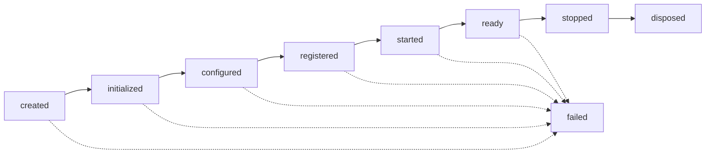

# Module Lifecycle — TEAF

El ciclo de vida de una instancia de `ModuleBase`: ocho estados (`ModuleLifecycleState`), siete hooks opcionales, y el orden exacto en que `bootstrap()`/`shutdown()` los recorre. Vive en `teaf/_internal/sdk/lifecycle.py` y `teaf/_internal/sdk/module_base.py`. Ver visión general en [SDK.md](SDK.md).

## 1. Los ocho estados



`ModuleLifecycle` (instanciado automáticamente en `ModuleBase.__init__`, expuesto como `self.lifecycle`) rastrea el estado actual y el historial completo:

```python
module.lifecycle.state    # ModuleLifecycleState.READY
module.lifecycle.history  # (CREATED, INITIALIZED, CONFIGURED, REGISTERED, STARTED, READY)
module.lifecycle.as_dict()  # {"state": "ready", "history": ["created", "initialized", ...]}
```

`advance(state)` rechaza retroceder en `CANONICAL_ORDER` (por ejemplo, de `CONFIGURED` a `INITIALIZED`) con `ValueError` — un módulo no "vuelve a inicializarse", se crea una instancia nueva. `FAILED` es la única excepción: alcanzable desde cualquier estado, y terminal (ningún avance posterior es válido tras `FAILED`).

## 2. Los siete hooks

Todos opcionales — `ModuleBase` los define como métodos vacíos por defecto. Cada uno puede sobrescribirse como método síncrono o `async` indistintamente (`bootstrap()` los invoca con `invoke_hook`, la misma utilidad que usa `LifecycleManager` del Runtime desde Sprint 2.3):

| Hook | Cuándo se ejecuta | Para qué |
|---|---|---|
| `initialize(context)` | Primero | Preparar estado interno, sin tocar el Runtime todavía. |
| `configure(context)` | Tras `initialize` | Aplicar `context.configuration`. |
| `register(context)` | Después de enlazar automáticamente servicios/capacidades | Wiring adicional que el manifiesto declarativo no cubre. |
| `start(context)` | Tras `register` | Arrancar recursos propios (conexiones, workers). |
| `ready(context)` | Último paso de `bootstrap()` | El módulo está completamente operativo. |
| `stop(context)` | Primer paso de `shutdown()` | Detener recursos propios — simétrico a `start`. |
| `dispose(context)` | Último paso de `shutdown()` | Liberar cualquier recurso final — simétrico a `initialize`. |

```python
class DemoModule(ModuleBase):
    def get_manifest(self) -> ModuleManifest: ...

    def initialize(self, context: ModuleContext) -> None:
        self._client = None  # síncrono

    async def start(self, context: ModuleContext) -> None:
        self._client = await connect()  # asíncrono — ambos son válidos
```

## 3. `bootstrap()` — el orden exacto

`ModuleBase.bootstrap(context)` (heredado, **nunca sobrescrito**) ejecuta, en este orden:

1. `manifest = self.get_manifest()`.
2. `ModuleValidator().validate_or_raise(manifest)` — `ModuleValidationException` si falla.
3. Comprueba compatibilidad (`_check_compatibility`, ver sección 4) — `ModuleCompatibilityException` si falla.
4. Registra el módulo en `ModuleRegistry` (Core) vía `context.runtime.register_module(...)` — `ModuleRegistrationException` si el módulo ya existía.
5. Hook `initialize` → avanza a `INITIALIZED`.
6. Hook `configure` → avanza a `CONFIGURED`.
7. `ServiceBinder().bind(manifest.services, ...)` y `CapabilityBinder().bind(manifest.capabilities, ...)` — sin hook asociado, es automático.
8. Hook `register` → avanza a `REGISTERED`.
9. Hook `start` → avanza a `STARTED`.
10. Hook `ready` → avanza a `READY`.

Cualquier excepción en los pasos 2-4 o dentro de un hook hace que `self.lifecycle.advance(FAILED)` se ejecute antes de relanzar — nunca queda en un estado intermedio ambiguo. Un fallo dentro de un hook se envuelve siempre en `ModuleLifecycleException` (con el nombre del hook y la etapa en el mensaje), incluso si la excepción original era de otro tipo.

`shutdown(context)` es más simple: hook `stop` → `STOPPED`, hook `dispose` → `DISPOSED`. Simétrico a los dos últimos pasos de `bootstrap()`, sin las validaciones previas (ya se hicieron al arrancar).

## 4. Compatibilidad Runtime/SDK

`_check_compatibility` (privado, en `module_base.py`) compara `manifest.runtime_compatibility` contra `context.runtime.framework_version`, y `manifest.sdk_compatibility` contra `teaf._internal.sdk.SDK_VERSION` — ambas usando el mismo comparador interno, `_satisfies_constraint`:

| Constraint | Significado |
|---|---|
| `"*"` o `""` | Siempre compatible. |
| `"1.2.3"` (sin operador) | Equivalente a `"==1.2.3"`. |
| `">=1.2"`, `"<=1.2"`, `">1.2"`, `"<1.2"` | Comparación numérica estándar. |
| `"~=1.2"` | Compatible dentro de la misma versión menor (`1.2.x`, no `1.3.0`). |

Solo se compara la parte numérica de la versión — un `framework_version` como `"0.5.0-alpha"` se trata como `(0, 5, 0)`, ignorando el sufijo. Las versiones se comparan con relleno de ceros si tienen distinta longitud (`"1.0"` satisface `">=1.0.0"`).

## 5. Buenas prácticas

- **No captures `context` fuera de los hooks** — cada llamada a `bootstrap()`/`shutdown()` recibe un `ModuleContext` fresco; guardarlo en un atributo de instancia para usarlo luego rompe la simetría start/stop si el módulo se recicla.
- **`stop`/`dispose` deben ser simétricos a `start`/`initialize`** — si `start` abre una conexión, `stop` debe cerrarla; el SDK no libera nada automáticamente.
- **Nunca asumas que `bootstrap()` se completó si capturas la excepción de un hook** — revisa `module.lifecycle.state`; si es `FAILED`, el módulo no está en un estado utilizable y no debe usarse.
- **Declara `runtime_compatibility`/`sdk_compatibility` explícitos en producción** — `"*"` es válido para desarrollo, pero un módulo distribuido debería fijar el rango real que probó.
